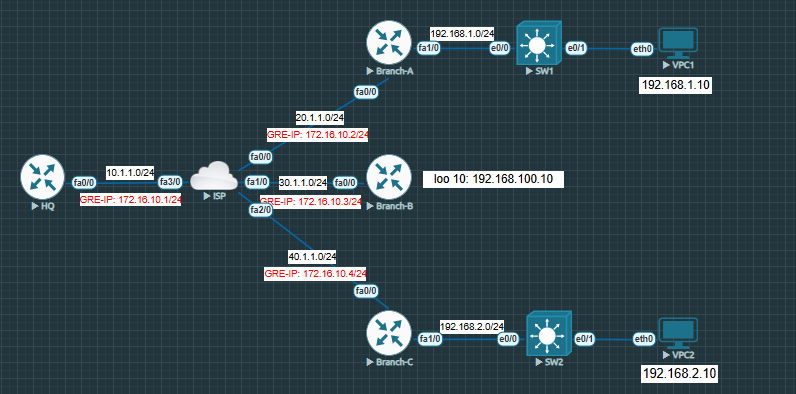

# DMVPN Lab in EVE-NG (HQ + Branches A/B/C)

## Overview
This repository contains my Dynamic Multipoint VPN (DMVPN) Phase 2 lab built on "EVE-NG", simulating HQ and three branches over an ISP cloud.

## Topology
- GRE/NHRP network: `172.16.10.0/24`
- HQ WAN IP: `10.1.1.2/24`
- Branch A WAN IP: `20.1.1.2`
- Branch A LAN: `192.168.1.0/24`
- Branch B WAN IP: `30.1.1.2`
- Branch B loopback test: `192.168.100.10`
- Branch C WAN IP: `40.1.1.2`
- Branch C LAN: `192.168.2.0/24`

## What I Practiced
- DMVPN Phase 2 (mGRE + NHRP) 
- Dynamic routing (EIGRP) across spokes
- Branch-to-branch direct communication

## Configurations
All device configs are in [`configs/`](./configs):
- [HQ](./configs/HQ.txt)
- [Branch A](./configs/BranchA.txt)
- [Branch B](./configs/BranchB.txt)
- [Branch C](./configs/BranchC.txt)

## Verification
Key command outputs and pings are in [`screenshots/`](./screenshots):
- `show dmvpn`, `show ip nhrp`, `show run`
- Branch-to-branch pings (e.g., A ↔ C)

## How to Reproduce (High-Level)
1. Build the same topology in **EVE-NG**.
2. Apply configs from `configs/` to each router.
3. Verify NHRP/DMVPN and end-to-end pings.

